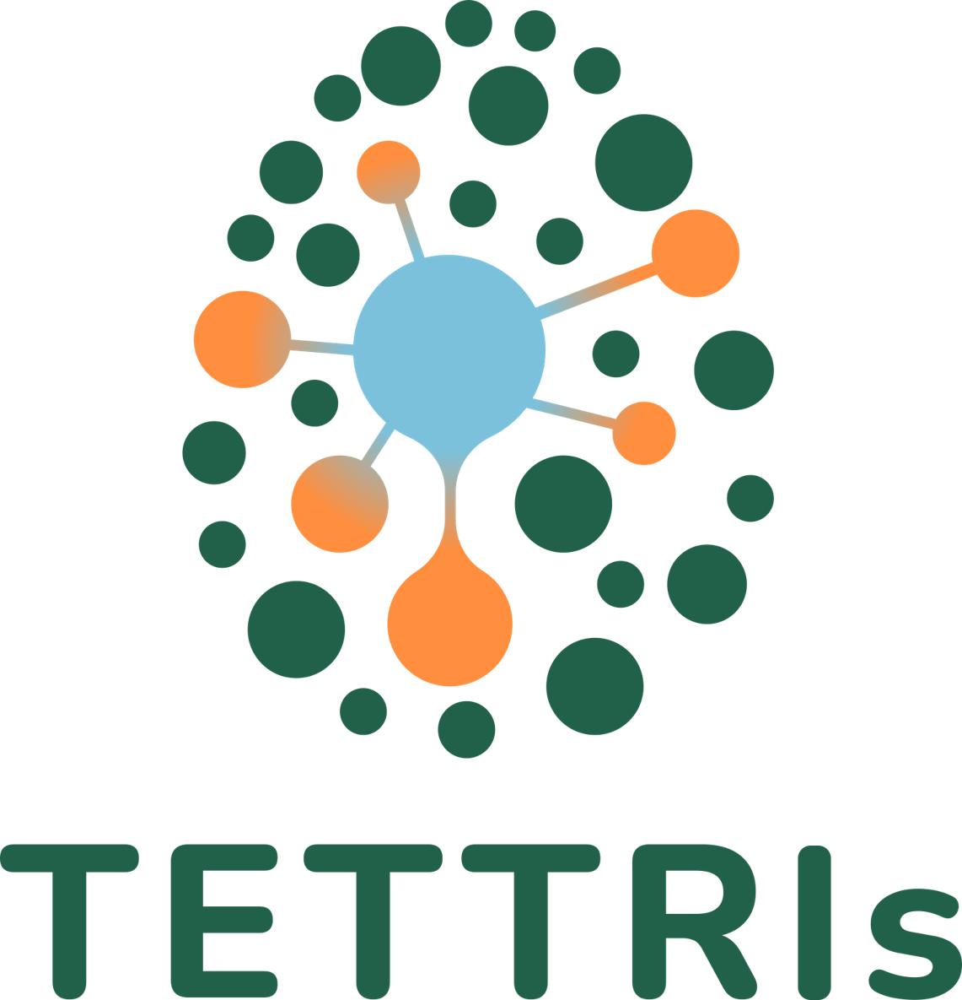

  <h1>Genomic Workflows for Taxonomy</h1>
  

Authors: Frederik Hendrickx and Carl Vangestel, 2025

License: CC-BY 4.0

This repository is designed to help taxonomists **integrate genomic data into their taxonomic research to identify and delineate species, assess their intra- and interspecific genetic divergence and to reconstruct patterns of speciation**. The goal is to provide clear, step-by-step workflows that take you from raw sequencing reads all the way to advanced analyses of genome-wide patterns of species differentiation. The workflows are especially tailored for **complexes of closely related species**, including cryptic species and recent radiations, where single gene analyses generally do not provide reliable taxonomic insight. 
  
Here, you find guidance on:  
**- Preprocessing raw sequencing data** to ensure high-quality inputs  
**- Mapping reads to reference genomes**  
**- Identifying single nucleotide polymorphisms (SNPs)**  
**- Analyzing genetic relationships among individuals**  
**- Visualizing results to uncover patterns of divergence and relatedness**  
  

Depending on the type of sequencing data you have, three tailored workflows are available:  
**1.	Whole-Genome Resequencing** – For studies with sequencing data that cover the entire genome and a reference genome is available for the focal species or a close relative.  
**2.	RAD/GBS with Reference Genome** – For datasets generated via Restriction-site Associated DNA (RADseq) or Genotyping-by-Sequencing (GBS), where a reference genome is available.  
**3.	RAD/GBS without Reference Genome** – For situations where RAD or GBS data are available but no reference genome exists, providing a de novo approach to analyze genetic variation.  
Each workflow is modular and reproducible, guiding you from raw data to meaningful biological insights.

## Workflows
- [Whole-Genome Resequencing Data](./whole_genome_resequencing/)
- [RAD/GBS with Reference Genome](./rad_gbs_with_reference/)
- [RAD/GBS without Reference Genome](./rad_gbs_without_reference/)

## Acknowledgments

This project has been funded and is being developed as part of [TETTRIs - Task 6.2, WP6](https://tettris.eu).

