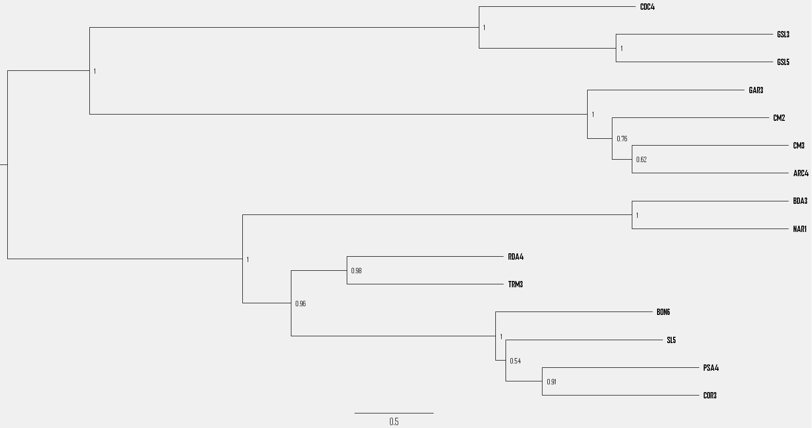

# Consensus tree and visualisation

The previous step produced a large collection of phylogenetic trees, each representing the relationships among individuals for a different genomic region. Two approaches can provide an overall view of the genetic relationships among these individuals: (i) constructing a consensus tree that summarizes information across all individual trees, and (ii) visualizing the entire set of trees using a DensiTree graph.

### 1. Consensus tree
We can generate a consensus species tree that integrates information from all individual trees using **ASTRAL**. Using the `project.trees` file containing all ML trees, the ASTRAL consensus tree can be estimated with the following command:

```bash
#!bin/bash

cd ~/project

# Define in and output files
TREE_ASTRAL="./astral/project.astral.contree"
TREES_WINDOWS="./trees/project.trees"

# Astral consensus tree
java -jar  astral.5.6.3.jar -i "$TREES_WINDOWS" -o "$TREE_ASTRAL"
```

This consensus tree can now be visualized with your program of choice, such as [FigTree](https://tree.bio.ed.ac.uk/software/figtree/).

Note that the branch lengths in the ASTRAL tree do not represent standard evolutionary distances, as in trees inferred directly from (concatenated) sequence data. Instead, they are measured in coalescent units and reflect the concordance among the individual trees. To quantify the degree of support for each clade, **gene concordance factors (gCFs)** can be calculated, indicating the percentage of trees that support a given branch. Using the `project.trees` file along with the ASTRAL species tree, gCFs can be computed in IQ-TREE with the following script:

```bash
#!/bin/bash

cd ~/project

# Define in and output files
TREE_ASTRAL="./astral/project.astral.contree"
TREES_WINDOWS="./trees/project.trees"
OUT="./astral"

# Calculate gCF
iqtree2 -t "$TREE_ASTRAL" --gcf "$TREES_WINDOWS" -pre "$OUT"
```

And we can visualize this tree in FigTree:


### 2. Plot DensiTree

Another way to visualize the consistency in the topology among the trees is to superimpose all the trees on each other, which is called a DensiTree. The R package *phangorn* has a function to do this. Before the trees are superimposed, it is important to ammply the same rooting to the trees (e.g. midpoint rooting in absence of an outgroup) and make the trees ultrametric such that the tips align properly. Below is some R code to plot a densitree:

```r
# Load libraries
library(phangorn)
library(ape)


# Read unrooted trees
trees_iqtree<-read.tree(file='~/project/project.trees')
class(trees_iqtree)<-"multiPhylo"

# Step 1. Midpoint rooting of trees
trees_rooted <- lapply(trees_iqtree, function(tr) midpoint(tr))
class(trees_rooted)<-"multiPhylo"

# Step 2. Transform to ultrametric trees
# Options: "nnls" (non-negative least squares), "chronos", "force"
trees_ultra <- lapply(trees_rooted, function(tr) chronos(tr,lambda=1))

# Specify tip order for plotting
tax_order1=c('sample_01','sample_02','sample03',...,’sample_12’)

# Plot DensiTree
class(trees_ultra)<-"multiPhylo"
densiTree(trees_ultra,consensus=tax_order1,alpha=0.1,scaleX=T,direction="rightwards")
```


